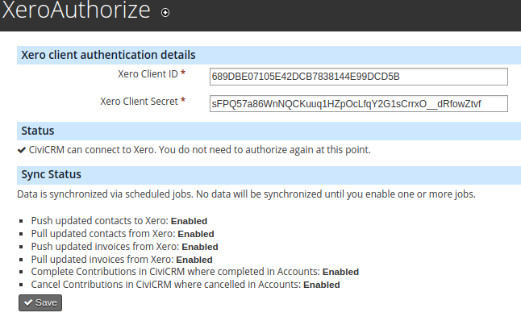

# Setup Xero integration

## Download and enable the AccountSync and Xero extensions

In the server in the sites, extensions folder in a terminal window you can run the command

`git clone https://github.com/eileenmcnaughton/nz.co.fuzion.civixero.git`

and the same for AccountSync

`git clone https://github.com/eileenmcnaughton/nz.co.fuzion.accountsync.git`

then you will have the extensions added to the site.

To use these extensions on the site, on the CiviCRM menu on the site go to administer - customise data and screens - manage extensions. There you should install CiviXero and AccountSync.

## Setup XERO OAuth 2.0

You will need to have set up an company/organisation and an OAuth 2.0 App with XERO.

### Company/Organization
For testing purposes, you can use the [Xero Demo Company](https://central.xero.com/s/article/Use-the-demo-company)

### Create Xero App
Before creating the app, it will help to be logged into CiviCRM as well as Xero.

Go to https://developer.xero.com/

On the menu, click on __MyApps__, then click __New app__.

Use the following details:
- __App name__: A name of your choice eg. "CiviCRM".
- __Integration type__: Web app.
- __Company or application URL__: Enter your website URL - eg. https://example.org
- __OAuth 2.0 redirect URI__: this is the __URL of the Xero Authorize page__ in CiviCRM. Navigate to the page, __Administer -> Xero -> Xero Authorize__ and copy the URL to this page. Xero will validate using this URL. If working in a local development environment, then use localhost as the domain name. Eg. https://example.org/civicrm/xero/authorize

Once the app is created click the __Configuration__ tab:
- Copy the __Client id__.
- Click __Generate a secret__ and copy this.

## Setup in CiviCRM

### Authorizing with Xero
Next, authorize the app to access your Xero Company data.

In CiviCRM, go to *Administer->CiviContribute->Xero->Xero Authorize* and enter your Xero Client ID and Xero Client Secret.

Click the button to __Authorize with Xero__.

You will be redirected to Xero and prompted for your Xero credentials and then further prompted to grant the app various permissions.
You should then be returned to the Authorize page.

The page will show a status to indicate it has successfully connected to Xero:

### Configure CiviCRM Xero Settings

You now need to configure various parameters to control how the data should be synced.

Open the Xero Setttings page in CiviCRM - *Administer->CiviContribute->Xero->Xero Settings*.

On this page you should also define which edit and create actions should trigger contacts / invoices to be created / edited in Xero.

### Set up Synchronization
Once authorized you interact with CiviXero via the scheduled jobs page and the api. Matched contacts should show links on their contact summary screen and matched contributions should show links on the invoices

CiviCRM tracks synchronisation in the civicrm_account_contact table - to populate this from xero run the api command civixero contactpull with a start_date - e.g '1 year ago'

e.g
drush cvapi civixero.contactpull start_date=0

## Customisation and Additional Extensions

To modify the behaviour of the CiviXero extension various hooks are available. The additional CiviCRM extensions are available:

[Xero Tweaks](https://github.com/agileware/au.com.agileware.xerotweaks)
- Removes the Contact ID from their Xero name.
- Includes additional address lines in the contact address.
- Removes the Contact's name from the Invoice Reference and Line items.

[Xero Untax](https://github.com/agileware/au.com.agileware.xerountax)
- Remove tax details from line items sent via CiviXero, so Xero can figure it out avoiding rounding issues.

[Xero Items](https://github.com/agileware/au.com.agileware.xeroitems)
- Replaces Xero account codes with [Xero item codes](https://help.xero.com/nz/Inventory) (also referred to as Xero inventory items)

## Linking from Xero to CiviCRM

You can create a link from Xero back to your site by going to settings/ Custom links and adding a link pointing to

https://YOURSITE/civicrm/contact/view?reset=1&cid={!CONTACTCODE}
